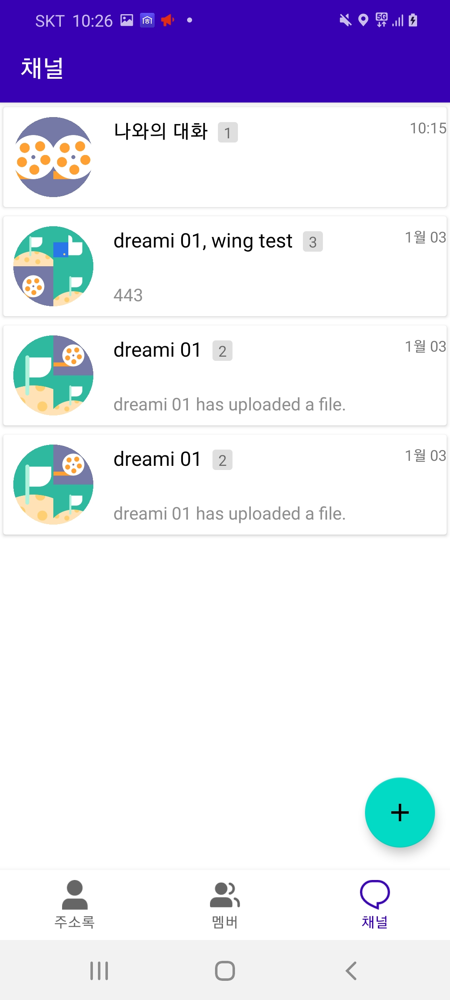

# STL samples


💻 Requirements
----------------
project from Android Studio 4.1


stl-core using the architectures
- [Sendbird](https://github.com/sendbird/Sendbird-Android)
- [Coroutine](https://developer.android.com/kotlin/coroutines)
- [RxJava3](https://github.com/ReactiveX/RxJava)
- [Room](https://developer.android.com/topic/libraries/architecture/room)
- [Koin](https://github.com/InsertKoinIO/koin)


stl-ui using the [Architecture Components](https://developer.android.com/arch):
- [Lifecycle-aware components](https://developer.android.com/topic/libraries/architecture/lifecycle)
- [ViewModels](https://developer.android.com/topic/libraries/architecture/viewmodel)
- [LiveData](https://developer.android.com/topic/libraries/architecture/livedata)
- [Paging3](https://developer.android.com/topic/libraries/architecture/paging/)
- [ViewBinding](https://developer.android.com/topic/libraries/view-binding)
- [Coroutine](https://developer.android.com/kotlin/coroutines)


This sample showcases:

* TODO : showcase......




### Samples

* **[basic-Java](https://github.com/dreamisoft/stl-android-sample/blob/master/basic-java)** - Shows how to use STL core. Also uses ViewModels and LiveData.


### Installation
---------------------
Step 1. Add the JitPack repository to your build file

Add it in your root build.gradle at the end of repositories:

```gradle
	allprojects {
		repositories {
			...
			maven { url 'https://jitpack.io' }
		}
	}
```
	

Step 2. Add the dependency

```gradle
	dependencies {
        implementation 'com.github.dreamisoft.stl-android:core:(insert latest version)'
        implementation 'com.github.dreamisoft.stl-android:ui:(insert latest version)'
	}
```


### Libraries

* [Glide][glide] for image loading
* [Exoplayer][exoplayer] for video playing
* [Splitties][splitties] a collection of small Kotlin libraries


[glide]: https://github.com/bumptech/glide
[exoplayer]: https://developer.android.com/guide/topics/media/exoplayer
[splitties]: https://github.com/LouisCAD/Splitties